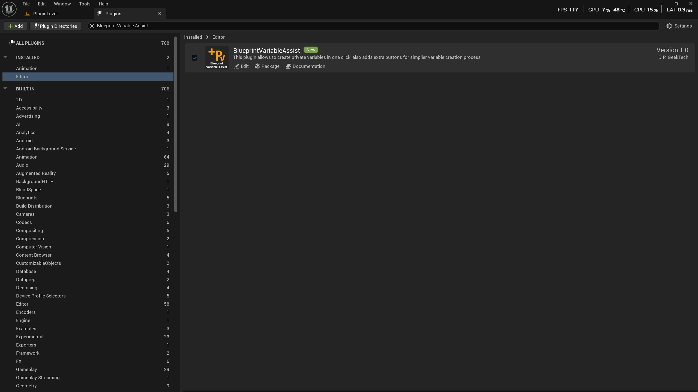

---

## ⚙️ Enabling the Plugin

1. Launch your Unreal Engine project.
2. Open **Edit → Plugins**.
3. Search for `Blueprint Variable Assist` in `Editor` section.
4. Click **Enable**.
5. Restart the editor when prompted.

>   
