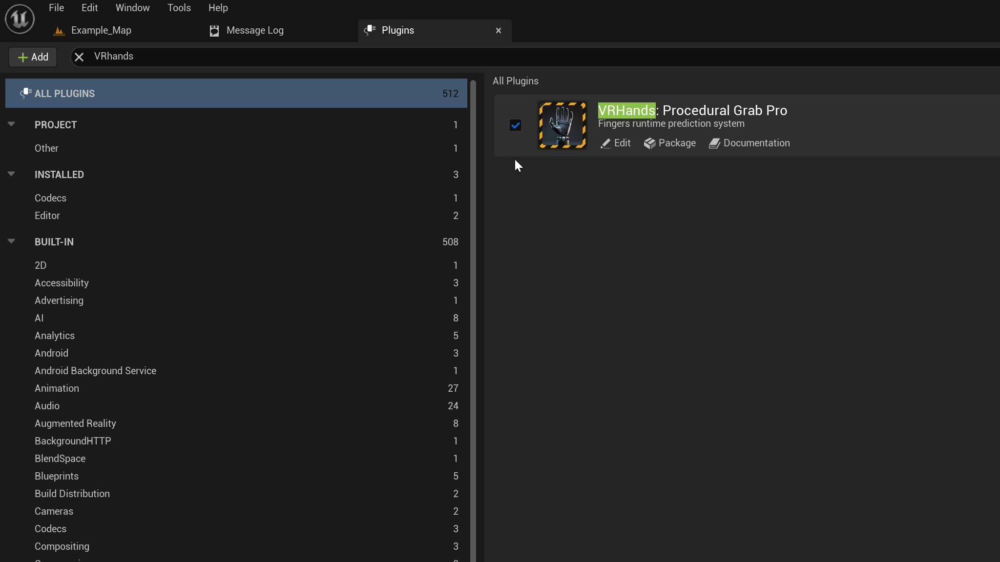
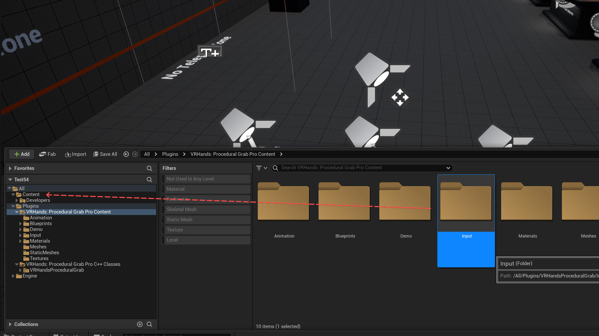
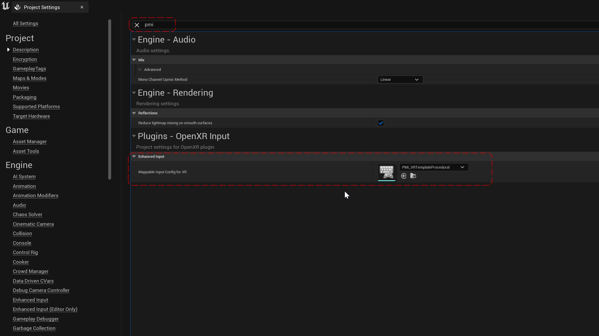
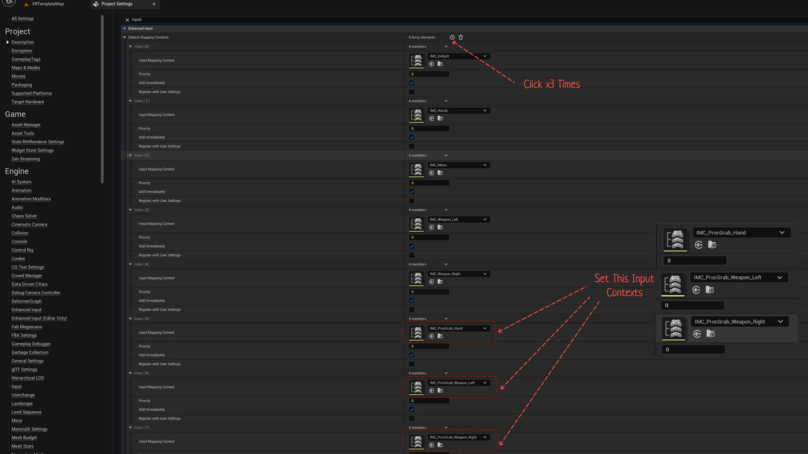
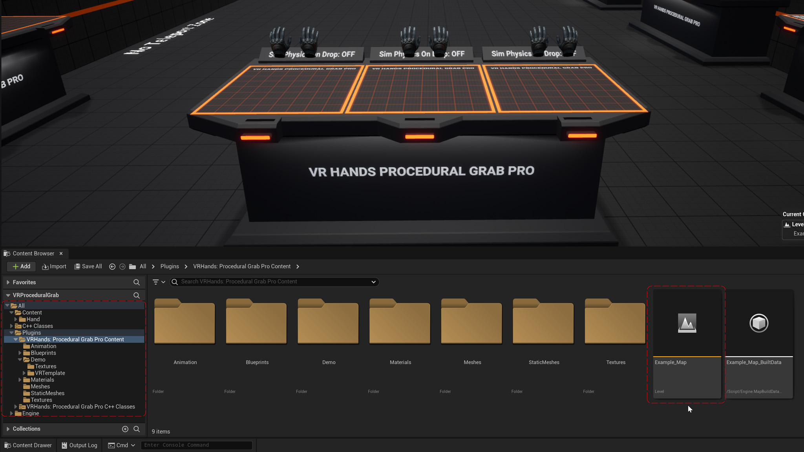
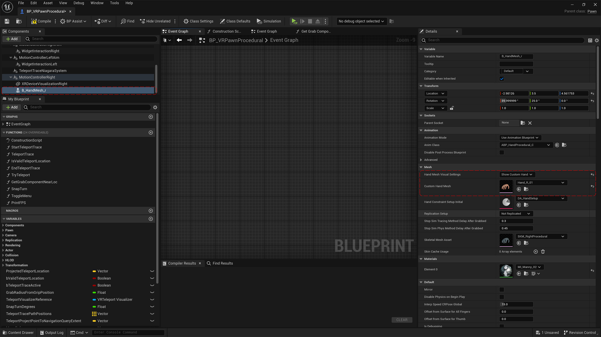
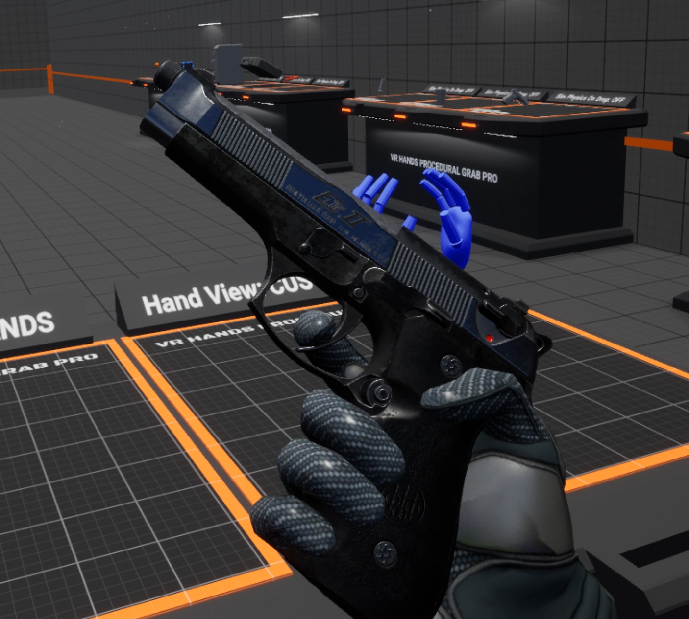

<!-- index.md - VR Hands Procedural Grab Pro Documentation -->

<h1 style="text-align:center;">VR Hands Procedural Grab Pro Documentation</h1>

  <iframe 
    width="900" 
    height="506" 
    src="https://www.youtube.com/embed/POnHDlsOoUM?list=PLL-p5fQ1kieBRZjUSCDwGizmAWjxniNj-" 
    title="VR Hands Procedural Grab Pro Getting Started" 
    frameborder="0" 
    allow="accelerometer; autoplay; clipboard-write; encrypted-media; gyroscope; picture-in-picture; web-share" 
    allowfullscreen 
    style="border-radius:12px; margin:12px auto; display:block;">
  </iframe>

  
  &nbsp;
  

---

## :material-rocket-launch: Quick Start Guide

### :material-cog-outline: Step 1 — Enable Plugin
> :material-arrow-right-bold-outline: **Plugins → Enable Plugin**  
> <a href="ScreenShots/EnablePlugin.jpg" class="glightbox">
>   
> </a>

---

### :material-cog-outline: Step 2 — Input Setup

1. Move plugin's Input Folder **`Plugins/VRHands:ProceduralGrabProContent/Input`** → into your **game project's `Content`** folder.  

!!! warning "This step is required"
    Any input context used by the **Enhanced Input** system **must** be placed inside your game's **Content** folder.  
    Plugin content is not packaged the same way and will not be discovered in packaged builds, which will cause inputs to stop working after packaging.

---

### :material-cog-outline: Step 2.1 — For UE 5.2
1. Search for **PMI** in Project Settings.  
2. Set **Mappable Input Config For XR** to `PMI_VRTemplateProcedural`.

---

### :material-cog-outline: Step 2.1 — For UE 5.3–5.6
1. Search Project Settings for **Input** → **Default Mapping Contexts**.  
2. Add 3 array items and set:
   - `IMC_ProcGrab_Hand`
   - `IMC_ProcGrab_Weapon_Left`
   - `IMC_ProcGrab_Weapon_Right`

---

### :material-dock-window: Step 3 — Open Example Map
Open: **Plugins/VRHands:ProceduralGrabProContent/Example_Map**

---

## :material-cog-outline: Setting Custom Hands Mesh

1. Open **BP_VRPawnProcedural**.  
2. Select **B_HandMesh_r** component.  
3. Set enum **Hand Mesh Visual Settings** → **Show Custom Hand** and choose your right-hand skeletal mesh.  
4. Repeat for **B_HandMesh_l** to set the left hand.

---

## :material-gift: Get Human Hands — FREE (How to claim)

You can receive the **Human Hands** mesh pack for free by following these steps:

1. **Rate the product on** [**Fab**](https://www.fab.com/listings/0d7009c6-ad1b-41d0-96d0-56ae95e59653)

2. **Write a few words (feedback) on the** [**Fab Forum**](https://forums.unrealengine.com/t/geektech-vr-hands-procedural-grab-pro/2668162)

3. **Contact me to confirm:** [geektechcg@gmail.com](mailto:geektechcg@gmail.com)  
   or send a [direct message](https://forums.unrealengine.com/u/iD.P/summary) on the forum.  
   Don’t forget to include your **forum username**.

> **After confirmation**, I’ll provide the download link for the Human Hands pack.  

---

### Troubleshooting & Tips

??? tip "Input not detected in packaged game?"
    - Make sure the **Input** folder was moved into your **game project's `Content`** folder (not left inside the plugin).
    - Check Project Settings → Input to ensure the mapping contexts are listed.
    - Review [Step 2 — Input Setup](#step-2-input-setup)

??? tip "Packaged standalone game (Android/Quest) crashed immediately when launched?"
    - Update Plugin To the latest version
    - Make sure your plugin’s .uplugin file includes Android in the Platform Allow List
   
    - Go to your plugin folder
    - Open VRHandsProceduralGrab.uplugin in Notepad 
    - Add Android PlatformAllowList **"PlatformAllowList": ["Win64", "Android"]**  
    
    For more information check out the video below  
     [Video: VR Hands Procedural Grab Pro: 4. Packaging for Quest 2, 3 (Android Devices) ](https://www.youtube.com/watch?v=xzRWyjQ4GzE&feature=youtu.be)
  

   

---

## :material-gift: Extra Files

### ⚙ Custom Gun Model

<a href="download/VRHandsProceduralGrabProCustomGun.rar" download>
⬇ Download Custom Gun Model from the Tutorial Video with Detached Parts (.rar)
</a>

Original Gun Model by eNse7en <https://sketchfab.com/3d-models/beretta-92g-brigadier-elite-ii-474cb73931114a669780783c44b5bb88>

---
### ⚙ DefaultEngine.ini

**UE 5.2**
<a href="download/5.2/DefaultEngine.ini" download>
⬇ Download DefaultEngine.ini
</a>

**UE 5.3 – 5.7**
<a href="download/5.6/DefaultEngine.ini" download>
⬇ Download DefaultEngine.ini
</a>

---

## :material-email-outline: Need Help?

Contact: [GeekTech](mailto:geektechcg@gmail.com)  
Plugin listing / updates: <https://www.fab.com/listings/0d7009c6-ad1b-41d0-96d0-56ae95e59653>

---

<small>
Plugin is developed and maintained by GeekTech. Compatible with Unreal Engine **5.2 – 5.6**.
</small>

---

*Ready to supercharge your VR Project? Get [**VR Hands Procedural Grab Pro**](https://www.fab.com/listings/0d7009c6-ad1b-41d0-96d0-56ae95e59653) now!*
