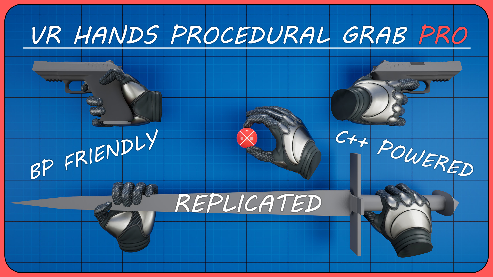

  
  &nbsp;
  

# VR Hands Procedural Grab Pro

---

## :material-rocket-launch: Quick Start Guide

### :material-cog-outline: Step 1: Enable Plugin ###

> :material-arrow-right-bold-outline: Plugins->Enable Plugin 
> 
---

###  :material-cog-outline: Step 2: Input Setup ###

> 1. Go to "Plugins/VRHands:ProceduralGrabProContent/

> 2. Move "Input" Folder to your actual game folder "Content"

> 
*“This step is required because any input context used by the Enhanced Input system must be located inside the game’s Content folder, not the plugin’s Content, otherwise it won't detect input in packaged projects”*

---

#### :material-cog-outline: Step 2.1 for UE 5.2

> 1. In search bar type: *"PMI"*

> 2. Set Mappable Input Config For XR to *"PMI_VRTemplateProcedural"*

---
#### :material-cog-outline: Step 2.1 for UE 5.3-5.6 ####

> 1. In search bar type: *"Input" or "Default Mapping Contexts"*

> 2. Click three times on plus icon to add 3 items to array

> 3. Add Contexts:
"IMC_ProcGrab_Hand",
"IMC_ProcGrab_Weapon_Left",
"IMC_ProcGrab_Weapon_Right"

> 

---
### :material-dock-window: Step 3: Open Example Map ###

> Example map is located here: **"Plugins/VRHands:ProceduralGrabProContent/Example_Map"**

> 

---

## :material-email-outline: Need Help?

Contact [GeekTech](mailto:geektechcg@gmail.com) or visit [plugin website on fab](https://www.fab.com/listings/0d7009c6-ad1b-41d0-96d0-56ae95e59653) for updates and documentation.

---

<small>
Plugin is developed and maintained by GeekTech.  
Compatible with Unreal Engine 5.2-5.6
</small>

---

*Ready to supercharge your VR Project? Get [**VR Hands Procedural Grab Pro**](https://www.fab.com/listings/0d7009c6-ad1b-41d0-96d0-56ae95e59653) now!*
