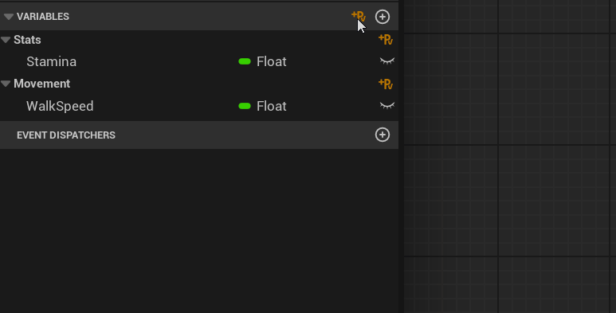
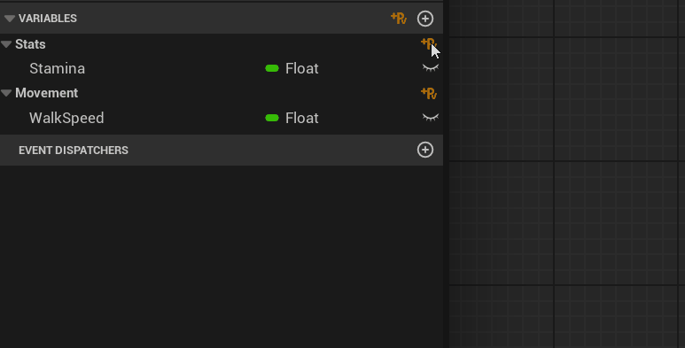
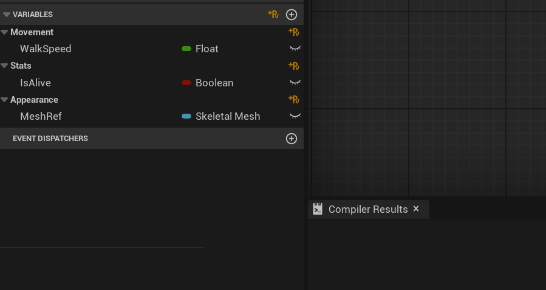
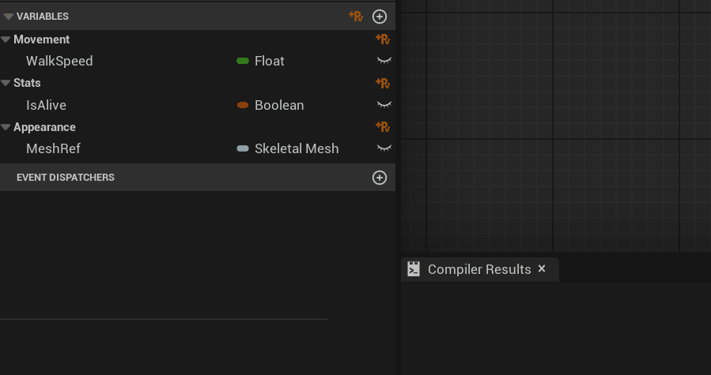
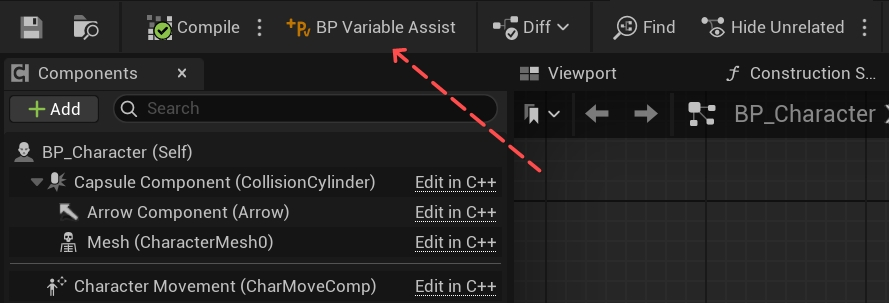
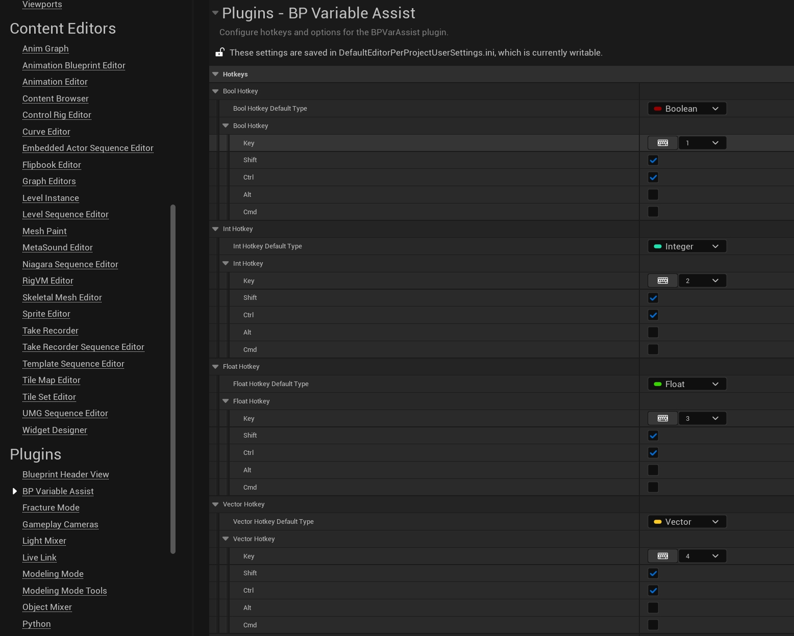

  
  &nbsp;
  

# BP Variable Assist

:material-rocket-launch: *A minimal, modern Unreal Engine plugin for **ultra-fast Blueprint variable management**.*

---

## :material-star-outline: Features

- :material-plus-box-multiple-outline: **One-click variable creation**  
  Add new variables instantly with a single click or hotkey.

- :material-folder-outline: **Category-aware insertion**  
  Adds variables directly to the category you choose—by button or by mouse hover.

- :material-keyboard-outline: **Customizable hotkeys**  
  Configure shortcuts for all variable types.

- :material-dock-window: **Toolbar integration**  
  Access plugin actions from the Blueprint Editor toolbar.

- :material-cog-outline: **Personalized workflow**  
  Set your preferences, variable types, and icon theme.

---

## :material-plus-box-multiple-outline: Add Variables by Button

### :material-arrow-right-bold-outline: Adding to Default Category

Add a private variable (with advanced display) to the **Default** category with one click:

>   
> :material-arrow-right-bold-outline: "Default" category  
> :material-checkbox-marked-outline: Private :material-checkbox-marked-outline: Advanced Display

---

### :material-arrow-right-bold-outline: Adding to Custom Category

Add a private variable (with advanced display) to any **custom** category you choose:

>   
> :material-arrow-right-bold-outline: :material-folder-outline: Specified category  
> :material-checkbox-marked-outline: Private :material-checkbox-marked-outline: Advanced Display

---

## :material-keyboard-outline: Add Variables by Hotkey

Assign hotkeys to instantly add variables of any type.  
Supports both Default and hovered categories.

| Hotkey                             | Variable Type    |
|-------------------------------------|------------------|
| <kbd>Ctrl</kbd>+<kbd>Shift</kbd>+<kbd>1</kbd> | Bool           |
| <kbd>Ctrl</kbd>+<kbd>Shift</kbd>+<kbd>2</kbd> | Int            |
| <kbd>Ctrl</kbd>+<kbd>Shift</kbd>+<kbd>3</kbd> | Float          |
| <kbd>Ctrl</kbd>+<kbd>Shift</kbd>+<kbd>4</kbd> | Vector         |
| <kbd>Ctrl</kbd>+<kbd>Shift</kbd>+<kbd>5</kbd> | Rotator        |
| <kbd>Ctrl</kbd>+<kbd>Shift</kbd>+<kbd>`</kbd> | Last Used Type |

---

### :material-arrow-right-bold-outline: Adding to Default Category (Hotkey)

>   
> :material-arrow-right-bold-outline: "Default" category  
> :material-checkbox-marked-outline: Private :material-checkbox-marked-outline: Advanced Display

---

### :material-cursor-default-outline: Adding to Custom/Hovered Category (Hotkey)

>   
> :material-cursor-default-outline: Hovered category  
> :material-checkbox-marked-outline: Private :material-checkbox-marked-outline: Advanced Display

---

## :material-dock-window: Toolbar Integration

Find the BPVarAssist button in your Blueprint Editor toolbar for quick access to plugin settings.

>   
> _BPVarAssist toolbar button in Blueprint Editor_

---

## :material-cog-outline: Settings

Personalize the plugin to fit your workflow.

- :material-keyboard-outline: Remap hotkeys  
- :material-vector-line: Set default variable types  
- :material-palette-outline: Choose icon theme (Gold or Platinum)

>   
> _Editor Preferences: BP Variable Assist plugin section_

---

## :material-email-outline: Need Help?

Contact [GeekTech](mailto:geektechcg@gmail.com) or visit [plugin website on fab](https://www.fab.com/listings/c4f462ba-0068-4961-8fa5-d76d192aa814) for updates and documentation.

---

<small>
BPVarAssist is developed and maintained by GeekTech.  
Compatible with Unreal Engine 5.1-5.6+
</small>

---

*Ready to supercharge your Blueprint workflow? Get [**BPVarAssist**](https://www.fab.com/listings/c4f462ba-0068-4961-8fa5-d76d192aa814) now!*
